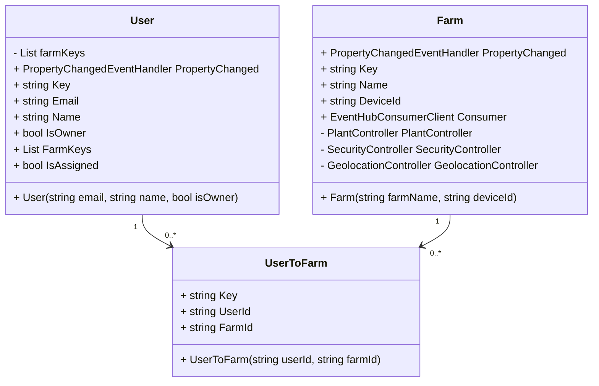

# 
 420-6A6-AB Application Development III
# 
 420-6P3-AB Connected Objects 
# 
 Winter 2024

### 
 Final Project

# Table of Contents
1. [Functional Overview](#functional-overview)
2. [Design Overview](#design-overview)
3. [App Prototype](#app-prototype)
4. [App UML Diagrams](#uml-diagrams)
    - [User & Farm](#user-farm-uml)
    - [Controllers](#controllers-uml)
5. [App Features](#app-features)
    - [Hardware Features](#hardware-features)
    - [Cloud Computing Features](#cloud-computing-features)
    - [Mobile App Features](#mobile-app-features)
    - [Potential Showstoppers](#potential-showstoppers)
6. [Document Link](#document-link)

> [!IMPORTANT]
> The README.md is subject to change as we progress through development.
> Stay up to date to observe the changes!

# Controlling Actuators

## Plant Subsystem Device Documentation

Follow the port guide below to sucessfully utilize the farm setup. 

| Sensor/Actuator       		| Port on Grove Base Hat | Port Type   | Unit                 |
|---------------------------|------------------------|-------------|----------------------|
| Soil Moisture Sensor  		| 0                      | PIN         | Ω                    |
| Temperature/Humidity Sensor 	| 4                  | PIN         | Temp: °C, Humi: % HR |
| Water Level Sensor    		| 5                      | PIN         | water level          |
| Fan                   		| 12                     | PIN         | N/A                  |
| LED                   		| 18                     | PIN         | N/A                  |

## Security Subsystem Device Documentation

Follow the port guide below to sucessfully utilize the farm setup.

| Sensor/Actuator       | Port on Grove Base Hat | Port Type   | Unit     |
|-----------------------|------------------------|-------------|----------|
| Loudness Sensor       | 2                      | PIN         | unitless |
| Luminosity Sensor     | N/A                    | BUS         | nm       |
| Motion Sensor         | 22                     | PIN         | N/A      |
| Vibration Sensor      | 26                     | PIN         | N/A      |
| Servo                 | 16                     | PIN         | N/A      |

## Geolocation Subsystem Device Documentation

Follow the port guide below to sucessfully utilize the farm setup.

| Sensor/Actuator | Port on Grove Base Hat | Port Type | Unit |
|-----------------|------------------------|-----------|------|
| Accelerometer   | N/A                    | BUS       | °    |
| Buzzer          | N/A                    | BUS       | N/A  |
| GPS             | /dev/ttyS0             | UART      | N/A  |

## Controlling the Actuators from the Cloud:
Direct Methods are used to control each actuator. We felt that it made the most sense since we control them
with a method in our code to just invoke the same method with the parameters specified in the payload.

### Fan
The target field must be set to fan and the value can be either on or off. 
`az iot hub invoke-device-method --hub-name cropcare --device-id {device_id} --method-name control_actuator --method-payload '{"target":"fan", "value": "on"}'`

### Buzzer
The target field must be set to buzzer and the value can be either on or off.
`az iot hub invoke-device-method --hub-name cropcare --device-id {device_id} --method-name control_actuator --method-payload '{"target":"buzzer", "value": "on"}'`

### Servo
The target field must be set to servo and the value can be a float from -1 to 1 inclusively.
`az iot hub invoke-device-method --hub-name cropcare --device-id {device_id} --method-name control_actuator --method-payload '{"target":"servo", "value": "1"}'`

### LED
The target field must be set to led and the value can be either on or off.
`az iot hub invoke-device-method --hub-name cropcare --device-id {device_id} --method-name control_actuator --method-payload '{"target":"led", "value": "on"}'`

## Additional Communication from the Cloud
We can also get the state of any actuator we want without changing them by using the following command:
`az iot hub invoke-device-method --hub-name cropcare --device-id {device_id} --method-name get_single_actuator_state --method-payload '{"target":"fan"}'`

This will return a message resembling:
`{
  "payload": {
    "target": "fan",
    "value": "ON"
  },
  "status": 200
}`
To set telemetryInterval to 5 seconds:
`az iot hub device-twin update -n cropcare -d {device_id} --desired '{"telemetryInterval": 5}'`

## D2C Messages
Longitude and Latitude to determine GPS location: 
- `az iot device send-d2c-message -n {iothub_name} -d {device_id} --data "{'reading_type': 'LONGITUDE', 'value': 152.408976, 'unit': '°'}"`
- `az iot device send-d2c-message -n {iothub_name} -d {device_id} --data "{'reading_type': 'LATITUDE', 'value': 152.408976, 'unit': '°'}"`

Temperature of the container:
- `az iot device send-d2c-message -n {iothub_name} -d {device_id} --data "{'reading_type': 'TEMPERATURE', 'value': 40.34324, 'unit': '°C'}"`

Humidity inside the container:
- `az iot device send-d2c-message -n {iothub_name} -d {device_id} --data "{'reading_type': 'HUMIDITY', 'value': 20.231, 'unit': '% HR'}"`

Luminosity for detecting light levels:
- `az iot device send-d2c-message -n {iothub_name} -d {device_id} --data "{'reading_type': 'LUMINOSITY', 'value': 433, 'unit': 'lux'}"`

Loudness inside the container:
- `az iot device send-d2c-message -n {iothub_name} -d {device_id} --data "{'reading_type': 'LOUDNESS', 'value': 200, 'unit': 'Db'}"`

Moisture of the soil:
- `az iot device send-d2c-message -n {iothub_name} -d {device_id} --data "{'reading_type': 'MOISTURE', 'value': 232.34311, 'unit': 'Ω'}"`

Waterlevel:
- `az iot device send-d2c-message -n {iothub_name} -d {device_id} --data "{'reading_type': 'WATERLEVEL', 'value': 221, 'unit': 'Ω'}"`

Motion inside the container:
- `az iot device send-d2c-message -n {iothub_name} -d {device_id} --data "{'reading_type': 'MOTION', 'value': True, 'unit': ''}"`

Vibration in the container:
- `az iot device send-d2c-message -n {iothub_name} -d {device_id} --data "{'reading_type': 'VIBRATION', 'value': False, 'unit': ''}"`

Magnet for detecting if the door is closed:
- `az iot device send-d2c-message -n {iothub_name} -d {device_id} --data "{'reading_type': 'MAGNET', 'value': True, 'unit': ''}"`

Pitch of the container:
- `az iot device send-d2c-message -n {iothub_name} -d {device_id} --data "{'reading_type': 'PITCH', 'value': 12.322, 'unit': '°'}"`

Roll of the container:
- `az iot device send-d2c-message -n {iothub_name} -d {device_id} --data "{'reading_type': 'ROLL', 'value': 56.7445, 'unit': '°'}"`

# 🌱 Functional Overview <a name="functional-overview"/>
CropCare seeks to deliver timely delivery of relevant data, and allow users to remotely control key systems for containerized gardens. Leveraling build in hardware solutions, we can monitor the relevant plant data and control related hardware to ensure secure and efficient plant growth. Our mobile application will facilitate this remote control and will provide users with a visual interface with which to view the relevant data.

# 📋 Design Overview <a name="design-overview"/>
Designing the CropCare Guardian app involves creating an intuitive and efficient user interface that caters to the specific needs of both crop owners and crop technicians. The app's design must facilitate easy navigation between its various functionalities while providing a seamless user experience. Below is a detailed overview of the app's design, including descriptions of each screen, screen design elements, and the navigation flow.

### Login page <a name="login-page"/>
This screen will allow users to sign in to their accounts. Additionally, if the user does not have an account, they can click a link that navigates them to the register page. The page will contain a username field, a password field and a sign in button. There will be input validation to ensure proper input before credentials entered are sent off to authenticate the user.

### Register page <a name="register-page"/>
This page will be used for account creation. A user will have to fill out an email field, a username field, two password fields to confirm they match and a register button. There will also be a link back to the login page in case a user wound up in the register page by mistake. Form input validation is important on this page as well. Once the register button is clicked and the inputs are validated, the user will be moved to the account setup page. 

### Account setup page <a name="account-setup-page"/>
This page will be used to set a user account as a crop owner or crop technician. It is important to properly include the written difference between the two types of accounts so users can know which account type suits their requirements. It will be two big cards or buttons on the screen each containing the description of the account type. Once selected, a user can hit the “confirm” button to confirm the account type they need. 

## Overview page <a name="overview-page"/>
This page will list all the containers a user is associated with. It will list its status as healthy, needs attention or in critical condition. The page will also have the ability to remove containers using a swipe view and when tapped will open up the dashboard of a container. A button will be placed in the bottom corner of the screen to add a container.

### Dashboard <a name="dashboard"/>
The top of the dashboard will contain the status of your container. It will show the status as healthy, needs attention, or in critical condition. Below this status will be a section containing buttons that navigate to other pages. There will be a button that navigates to the monitoring page, a button that navigates to the control page, and a button that will bring you to the gps page (gps page is only displayed to crop owner).

### Monitor page <a name="monitor-page"/>
This page is a comprehensive dashboard that provides detailed information on the current state of the container's environment using our sensors. It will display all the important information about a container in a neat and pleasing way.

### Remote control page <a name="remote-control-page"/>
This page empowers users to remotely control various components within the container, allowing for immediate adjustments to the environment based on the data observed on the Monitor Page.

### GPS page <a name="gps-page"/>
This page is solely for crop owners. This page will have an interactive map of the world and will contain a marker of where their container is currently located.

### General Navigation and Design Notes: <a name="navigation-notes"/>
In order to keep the screen less cluttered, a flyout menu will be used. This menu will contain the dashboard page, the settings page and a logout button. The items in this flyout menu will use shell navigation and all other pages will be navigated using stack navigation, the exception being the login and register page being shell navigation. 

### Settings page <a name="settings-page"/>
This page will contain settings for the account of our users. These settings may include toggling app themes from a light mode to a dark mode using a switch button, as well as changing username, password, and email using text boxes.

# 📱 App Prototype <a name="app-prototype"/>

# 🧩 App UML Diagrams <a name="uml-diagrams"/>

## User & Farm <a name="user-farm-uml"/>

## Controllers <a name="controllers-uml"/>

# 🛠️ App Features <a name="app-features"/>

### Hardware Features <a name="hardware-features"/>
- Monitoring
  - Measure relative water levels
  - Measure soil moisture levels
  - Read fan state (on/off)
  - Read light state (on/off)
  - Collect container GPS Location
  - Read container pitch and roll angles
  - Read vibration levels
  - Read buzzer state (On/Off)
  - Read noise levels
  - Read luminosity levels
  - Read motion sensor state (motion detected)
  - Read door-lock state (servo open/closed)
  - Read door state

- Remote Controls
  - Control buzzer state (On/Off)
  - Control door-lock state (servo open/closed)
  - Control fan state (on/off)
  - Control light state (on/off)

### Cloud Computing Features <a name="cloud-computing-features"/>
- Data Storage
  - Create a Cosmos storage account
  - Create a Cosmos Database to store the container information
  - Create all necessary containers
  - Create azure keyvault to store connection strings

- Web App API
  - Create endpoints to access logging information from Cosmos DB
  - Create endpoints to control container functions remotely

### Mobile App Features <a name="mobile-app-features"/>
- User Authentication
  - Build a user login/signup page
  - Create a user login system
  - Create a user sign-up system (Considering the two account types)
  - Implement a logout button
  - Ensure app differentiates between account types

- Supporting Infrastructure
  - Create a navigation bar and nested flyout menus
  - Create a logo for the application and company
  - Access environment variables

- Monitoring Page
  - Display all the data relating to the plants, such as moisture, and water levels through an interactive page
  - Alert fleet owner if there are security breaches/issues

- Remote Control Page
  - Display container state information, keeping in mind the current users authorization level, 
  - Allow users to control systems of the container farm, like the door or lights. Only allowing the user to control systems their authorization will allow.

- GPS Monitoring Page
  - Fleet manager should see a map with all their farms
  - A list of farms with their coordinates should be available
  - Should have a button where fleet owners can register new farms

- Settings Page
  - Design Settings Page
  - Allow user to change account details
  - Allow users to change color theme

# 🤩 Potential Showstoppers 
### Colour Theme 
To address the unique needs of every user and allow for a certain amount of customization, we wish to implement a colour switching option into our application. This will allow users to choose between light and dark themes enabling them to pick what fits best for them.

### Long Term Data Storage 
By leveraging azure's cosmos database, we can store monitoring data long term. While the IOT hub only stores data for a short period of time at specific times, cosmos can store data forever, allowing us to display historical data to our users.

### Container Health Level 
We want to show the health of the farm of the user in the farm overview, allowing users to quickly assess which farms require attention at a glance. This feature will prevent users from having to click on each farm and go into them and see which need attention.

# 🌐 Link to Our Document 
https://docs.google.com/document/d/1CgeMB0Ia7MkWsxPN-nKMrvUxbPpmW7MrcGwJhg-tKfA/edit?usp=sharing
