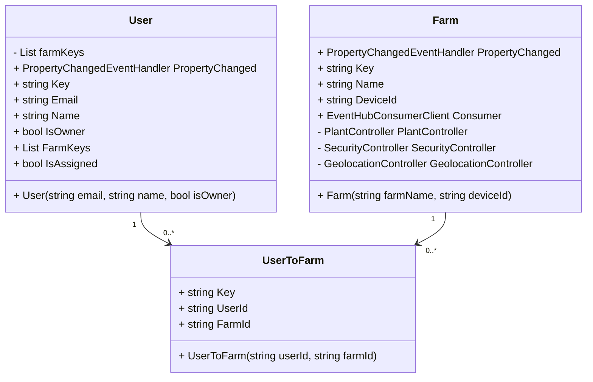
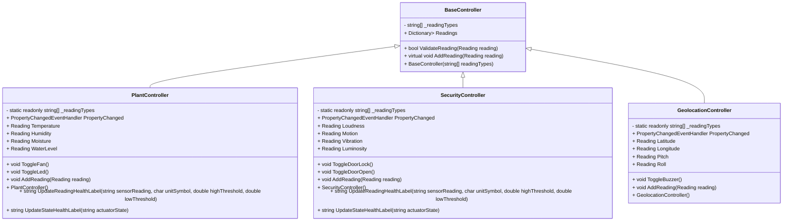

# 
 420-6A6-AB Application Development III
# 
 420-6P3-AB Connected Objects 
# 
 Winter 2024
### 
 Final Project
> [!IMPORTANT]
> The README.md is subject to change as we progress through development.
> Stay up to date to observe the changes!

### 🌟 **Team Information**
- **Team Name:** CropCare
- **Team Letter:** C
- **Team Members:** *&lt;Student Name : Student ID&gt;*
	- Cristiano Fazi : *2155506*
	- Kevin Baggott : *2140455*
	- Carson Spriggs-Audet : *2192019*
   	 
### 🌱 **Project Description**
CropCare is a solution created to combat the growth of urbanization and loss of valuable farmland. With our containerized farms, you can track the; temperature, humidity, soil moisture, water level, volumne, luminosity, motion, vibrations, location, and pitch/roll. You are also able to control the; fan, LED, door, door lock, and buzzer. This is achievable through the mobile application that has various IoT readings and messaging capabilities to ensure your container works to fulfill all your farming needs. The application supports two types of users, an Owner & a Technician. There is an important distinction between these two roles. An Owner is able to create farms, assign technicians, modify technicians, view location, and tweak farm settings. A technician does not have access to such things, they are only able to be added to farms and monitor plant and farm security. All of the farm accessibility is thanks to the Raspberri Pi reTerminal & backend code. The reTerminal connects to various sensors and actuators (as mentioned above) and sends all telemtry data to an Azure IoT device. This is the device that (when configured within an app using Device ID) then sends all telemetry data to the .NET MAUI application. The combination of the two codebases brings us to the final CropCare all-in-one farming solution.

### 🔧 **Contributions**

| Name                  | Contribution                      |
|-----------------------|-----------------------------------|
| Cristiano Fazi        | Full-stack developer & team lead  |
| Kevin Baggott         | Back-end & hardware developer     |
| Carson Spriggs-Audet  | Full-stack developer & designer   |

> [!NOTE]
> It is important to know that there were no distinct set roles, the contributions above are what each person primarily focused on, but each team member evenly contributed in various ways

### 📱 **Mobile App**
CropCare provides timely data and remote control for containerized gardens via built-in hardware solutions, ensuring secure and efficient plant growth. The CropCare app features an intuitive interface for farm owners and technicians. Users can sign in or register, set up accounts as crop owners or technicians, and view an overview of their containers' statuses (healthy, needs attention, critical). The dashboard displays container health and includes navigation to the Plant Monitoring, Security, and GPS pages (for owners only). The Plant Monitoring Page shows detailed environmental data from sensors, providing critical information about the container's environment. The Security Page allows users to adjust various components within the container, making immediate changes based on the monitoring data of security related needs. The GPS Page, exclusive to crop owners, features an interactive map showing the current location of their containers. Navigation is streamlined with a flyout menu and an overview page that links to the dashboard. The flyout menu houses settings, logout, and overview options using shell navigation for login and register pages and stack navigation for other pages. The Settings Page allows users to toggle app themes between light and dark modes, and update account details such as username, password, and email, ensuring a personalized and user-friendly experience.

### 🛠️ **App Overview**

#### Hardware Features <a name="hardware-features"/>
- Monitoring
  - Measure relative water levels
  - Measure soil moisture levels
  - Read fan state (on/off)
  - Read light state (on/off)
  - Collect container GPS Location
  - Read container pitch and roll angles
  - Read vibration levels
  - Read buzzer state (On/Off)
  - Read noise levels
  - Read luminosity levels
  - Read motion sensor state (motion detected)
  - Read door-lock state (servo open/closed)
  - Read door state

- Remote Controls
  - Control buzzer state (On/Off)
  - Control door-lock state (servo open/closed)
  - Control fan state (on/off)
  - Control light state (on/off)

#### ☁️ Cloud Computing Features <a name="cloud-computing-features"/>
- Azure IoT Setup
  - Able to create containers
  - Create azure keyvault to store connection strings

- IoT Access
  - Collect Telemetry data from Azure IoT hub
  - Allow for D2C commands to alter computer unit (Raspberry Pi reTerminal)'s state

### 📱 Mobile App Features <a name="mobile-app-features"/>
- User Authentication
  - Build a user login/signup page
  - Create a user login system
  - Create a user sign-up system (Considering the two account types)
  - Implement a logout button
  - Ensure app differentiates between account types

- Supporting Infrastructure
  - Create a flyout menu
  - Create a logo for the application and company
  - Access environment variables

- Overview
  - Owners are able to instantiate new farms
  - Owners & Technicians are able to enter farms assosciated with their user ID
 
- Dashboard
  - Users are able to see 3 general health statuses (Plant, Security, GPS)
  - Owners have the following cards; Plant, Security, GPS, Modify Technicians, Settings
  - Technicians have the following cards; Plant & Security

- Plant Monitoring Page
  - Display all the data relating to the plants, such as moisture, and water levels through an interactive page
  - Display health statuses according to current data

- Security Page
  - Display container state information
  - Allow users to control systems of the container farm, such as the door

- GPS Monitoring Page
  - Fleet manager should see a map on their farm page with the actual farm location
 
- Modify Technicians Page
  - The owner of a farm is able to modify the technicians who are assigned to a farm
 
- Farm Settings Page
  - Owners can; change farm name, change twin patch interval, and the icon of their farm

- Settings Page
  - Design Settings Page
  - Allow user to change account details
  - Allow users to change colour theme

### 🎨 App Prototype <a name="app-prototype"/>
<!--  -->

### 📐 **App UML Diagrams**

#### User & Farm <a name="user-farm-uml"/>

#### Controllers <a name="controllers-uml"/>

### ⚙️ **App Setup**
TBD.
>[!IMPORTANT]
>THIS IS NOT DONE YET. THIS IS A BIG JOB.

### 🚀 **Future Work**
- Implement Push Notifications
- Implement more colour themes
- Database storage of all data values
- Messaging system between any users

### 🎁 **Bonus Features**
- Support for multiple containers
- Built to-scale Container model
	- Design 3D models of Containers
	- Interactive hosted 3D model (https://carsonsgit.github.io/cropcare-3d/)
	- Used recycled materials
- Social Media presence
- Different colour themes
- Detailed presentation
- Overall health status of 3 categories displayed
	- Plant Monitoring
 	- Security
    - GPS

## 🌐 3D Model

> [!NOTE]
> If you want to interact with the 3D model, please click the image above or you can follow [this link](https://carsonsgit.github.io/cropcare-3d/)

# 🎮 Controlling Actuators

## 🌱 Plant Subsystem Device Documentation

Follow the port guide below to sucessfully utilize the farm setup. 

| Sensor/Actuator       		| Port on Grove Base Hat | Port Type   | Unit                 |
|---------------------------|------------------------|-------------|----------------------|
| Soil Moisture Sensor  		| 0                      | PIN         | Ω                    |
| Temperature/Humidity Sensor 	| 26                  | PIN         | Temp: °C, Humi: % HR |
| Water Level Sensor    		| 5                      | PIN         | water level          |
| Fan                   		| 12                     | PIN         | N/A                  |
| LED                   		| 18                     | PIN         | N/A                  |

## 🔒 Security Subsystem Device Documentation

Follow the port guide below to sucessfully utilize the farm setup.

| Sensor/Actuator       | Port on Grove Base Hat | Port Type   | Unit     |
|-----------------------|------------------------|-------------|----------|
| Loudness Sensor       | 2                      | PIN         | unitless |
| Luminosity Sensor     | N/A                    | BUS         | nm       |
| Motion Sensor         | 22                     | PIN         | N/A      |
| Vibration Sensor      | N/A                     | PIN         | N/A      |
| Servo                 | 16                     | PIN         | N/A      |
| Door Sensor           | 24                     | PIN         | N/A      |

## 🌍 Geolocation Subsystem Device Documentation

Follow the port guide below to sucessfully utilize the farm setup.

| Sensor/Actuator | Port on Grove Base Hat | Port Type | Unit |
|-----------------|------------------------|-----------|------|
| Accelerometer   | N/A                    | BUS       | °    |
| Buzzer          | N/A                    | BUS       | N/A  |
| GPS             | /dev/ttyS0             | UART      | N/A  |

## 🛠️ Controlling the Actuators from the Cloud:
Direct Methods are used to control each actuator. We felt that it made the most sense since we control them
with a method in our code to just invoke the same method with the parameters specified in the payload.

### 🌀 Fan
The target field must be set to fan and the value can be either on or off. 
`az iot hub invoke-device-method --hub-name cropcare --device-id {device_id} --method-name control_actuator --method-payload '{"target":"fan", "value": "on"}'`

### 🔊 Buzzer
The target field must be set to buzzer and the value can be either on or off.
`az iot hub invoke-device-method --hub-name cropcare --device-id {device_id} --method-name control_actuator --method-payload '{"target":"buzzer", "value": "on"}'`

### 🎚️ Servo
The target field must be set to servo and the value can be a float from -1 to 1 inclusively.
`az iot hub invoke-device-method --hub-name cropcare --device-id {device_id} --method-name control_actuator --method-payload '{"target":"servo", "value": "1"}'`

### 💡 LED
The target field must be set to led and the value can be either on or off.
`az iot hub invoke-device-method --hub-name cropcare --device-id {device_id} --method-name control_actuator --method-payload '{"target":"led", "value": "on"}'`

## 📡 Additional Communication from the Cloud
We can also get the state of any actuator we want without changing them by using the following command:
`az iot hub invoke-device-method --hub-name cropcare --device-id {device_id} --method-name get_single_actuator_state --method-payload '{"target":"fan"}'`

This will return a message resembling:
`{
  "payload": {
    "target": "fan",
    "value": "ON"
  },
  "status": 200
}`
To set telemetryInterval to 5 seconds:
`az iot hub device-twin update -n cropcare -d {device_id} --desired '{"telemetryInterval": 5}'`

## ⬆️ D2C Messages
Longitude and Latitude to determine GPS location: 
- `az iot device send-d2c-message -n {iothub_name} -d {device_id} --data "{'reading_type': 'LONGITUDE', 'value': 152.408976, 'unit': '°'}"`
- `az iot device send-d2c-message -n {iothub_name} -d {device_id} --data "{'reading_type': 'LATITUDE', 'value': 152.408976, 'unit': '°'}"`

Temperature of the container:
- `az iot device send-d2c-message -n {iothub_name} -d {device_id} --data "{'reading_type': 'TEMPERATURE', 'value': 40.34324, 'unit': '°C'}"`

Humidity inside the container:
- `az iot device send-d2c-message -n {iothub_name} -d {device_id} --data "{'reading_type': 'HUMIDITY', 'value': 20.231, 'unit': '% HR'}"`

Luminosity for detecting light levels:
- `az iot device send-d2c-message -n {iothub_name} -d {device_id} --data "{'reading_type': 'LUMINOSITY', 'value': 433, 'unit': 'lux'}"`

Loudness inside the container:
- `az iot device send-d2c-message -n {iothub_name} -d {device_id} --data "{'reading_type': 'LOUDNESS', 'value': 200, 'unit': 'Db'}"`

Moisture of the soil:
- `az iot device send-d2c-message -n {iothub_name} -d {device_id} --data "{'reading_type': 'MOISTURE', 'value': 232.34311, 'unit': 'Ω'}"`

Waterlevel:
- `az iot device send-d2c-message -n {iothub_name} -d {device_id} --data "{'reading_type': 'WATERLEVEL', 'value': 221, 'unit': 'Ω'}"`

Motion inside the container:
- `az iot device send-d2c-message -n {iothub_name} -d {device_id} --data "{'reading_type': 'MOTION', 'value': True, 'unit': ''}"`

Vibration in the container:
- `az iot device send-d2c-message -n {iothub_name} -d {device_id} --data "{'reading_type': 'VIBRATION', 'value': False, 'unit': ''}"`

Magnet for detecting if the door is closed:
- `az iot device send-d2c-message -n {iothub_name} -d {device_id} --data "{'reading_type': 'MAGNET', 'value': True, 'unit': ''}"`

Pitch of the container:
- `az iot device send-d2c-message -n {iothub_name} -d {device_id} --data "{'reading_type': 'PITCH', 'value': 12.322, 'unit': '°'}"`

Roll of the container:
- `az iot device send-d2c-message -n {iothub_name} -d {device_id} --data "{'reading_type': 'ROLL', 'value': 56.7445, 'unit': '°'}"`

# 🌐 Link to Our Document 
https://docs.google.com/document/d/1CgeMB0Ia7MkWsxPN-nKMrvUxbPpmW7MrcGwJhg-tKfA/edit?usp=sharing
